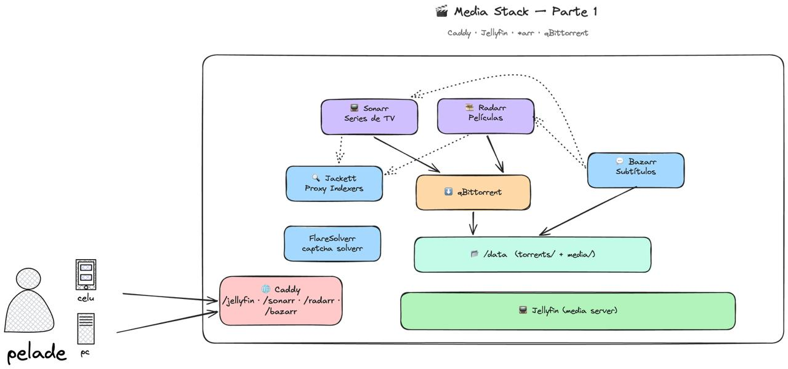

# Cyberdyne — Self-hosted Plex + *arr stack

Stack completo en Docker para correr tu propio servidor de medios en casa: películas, series, música, subtítulos, descargas y una UI estilo Netflix para pedir contenido, todo detrás de un único reverse proxy con routing por path.

## ¿Qué incluye?

- **Caddy** — reverse proxy con routing automático por path (un dominio, muchas apps)
- **Plex** — media server (`:32400`, no subpath — needed for TV/mobile app discovery)
- **Sonarr** / **Radarr** — automatización de bibliotecas (TV, películas)
- **Jackett** — gestor de indexers (expuesto en `:9117`, sin subpath)
- **FlareSolverr** — proxy que resuelve challenges de Cloudflare para indexers (`:8191`)
- **Bazarr** — subtítulos automáticos
- **qBittorrent** — cliente torrent
- **Jellyseerr** — UI de pedidos (un Netflix para tus usuarios)
- **Wizarr** — invitaciones de usuarios
- **Pi-hole** — DNS ad-blocking para toda la red (`:8081`, sin subpath)

Mirá [`architecture.excalidraw`](architecture.excalidraw) para el diagrama completo de topología (abrilo en <https://excalidraw.com>).

## Diagrama del stack

Quick view of how the pieces connect. Two devices (phone and PC) point at the server; Caddy routes by subpath to Sonarr/Radarr/Bazarr, Sonarr/Radarr/Jackett send torrents to qBittorrent which writes to `/data/torrents/`, and Plex (on its own dedicated port, bypassing Caddy) scans the final library in `/data/media/`.



La estructura interna de carpetas sigue la convención de [TRaSH Guides](https://trash-guides.info/File-and-Folder-Structure/How-to-set-up/Docker/) para que los *arr puedan usar hardlinks y moves atómicos. Ver [docs/DATA_LAYOUT.md](docs/DATA_LAYOUT.md) para el detalle.

## Requisitos

- Servidor Linux (o VM) con **Docker 24+** y **Docker Compose v2**
- ~20 GB libres en disco para configs y descargas (más si vas a tener una biblioteca grande)
- Puertos **80**, **443**, **53** (TCP+UDP), **8080**, **8081**, **9117**, **8191** y **32400** abiertos
- Si el host corre `systemd-resolved` (default en muchas distros), va a competir con Pi-hole por el puerto 53 — desactivalo antes de levantar el stack (ver [Troubleshooting](#troubleshooting))
- Un dominio público (recomendado para HTTPS) o entradas de DNS local — el stack funciona con `http://localhost` también, pero el HTTPS automático necesita un dominio real

## Inicio rápido

1. Cloná el repo:

   ```bash
   git clone https://github.com/rusito-23/cyberdyne.git
   cd cyberdyne
   ```

2. Copiá el archivo de ejemplo de variables de entorno:

   ```bash
   cp .env.example .env
   ```

   Por defecto, las configs se guardan en `./config/` y las descargas/bibliotecas en `./data/`. Editá `.env` si querés apuntarlas a otro lado (ver [Configuración](#configuración) más abajo).

3. Inicializá la estructura de `data/` (necesario una sola vez; `data/` está en `.gitignore` así que la tenés que crear vos):

   ```bash
   bash scripts/init-data-dirs.sh
   ```

   Esto crea `data/torrents/{movies,series,music}` (staging) y `data/media/{movies,series,music}` (biblioteca final) siguiendo la convención de TRaSH Guides. Es idempotente. Ver [docs/DATA_LAYOUT.md](docs/DATA_LAYOUT.md) para el detalle.

4. Levantá el stack:

   ```bash
   docker compose up -d
   ```

5. Esperá un minuto a que cada app genere su config inicial y corré el setup de subpaths:

   ```bash
   bash scripts/configure-base-urls.sh
   ```

   This configures each app's internal URL base so it responds under `/sonarr`, etc. It's idempotent — safe to run again.

6. Reiniciá las apps para que tomen las nuevas URLs:

   ```bash
   docker compose restart
   ```

7. Abrí las URLs en tu navegador:

   | App | URL |
   | --- | --- |
   | Sonarr | `http://tu-servidor/sonarr` |
   | Radarr | `http://tu-servidor/radarr` |
   | Bazarr | `http://tu-servidor/bazarr` |
   | Jellyseerr | `http://tu-servidor/jellyseerr` |
   | Wizarr | `http://tu-servidor/wizarr` |
   | **qBittorrent** | **`http://tu-servidor:8080`** |
   | **Jackett** | **`http://tu-servidor:9117`** |
   | **FlareSolverr** | **`http://tu-servidor:8191`** |
   | **Pi-hole** | **`http://tu-servidor:8081/admin`** |
   | **Plex** | **`http://tu-servidor:32400/web`** |

   La primera vez, cada app te pide crear una cuenta. Mirá [Configuración inicial](#configuración-inicial) más abajo.

> **Por qué Jackett, qBittorrent y FlareSolverr no usan subpath**: emiten URLs internas que no son compatibles con que un proxy strippee el prefijo (Jackett y FlareSolverr porque no tienen setting oficial de base URL, qBittorrent porque sus URLs son relativas en el HTML). Es la práctica estándar exponerlos en puertos dedicados. Ver [docs/DATA_LAYOUT.md](docs/DATA_LAYOUT.md) para más detalle.

## Configuración

### Rutas de almacenamiento

Por defecto, el stack guarda configs en `./config/` y medios/descargas en `./data/`, relativas al `docker-compose.yml`. Para moverlas a otro lado (por ejemplo `/srv/cyberdyne/`), editá `.env`:

```env
CONFIG_DIR=/srv/cyberdyne/config
DATA_DIR=/srv/cyberdyne/data
```

Después mové el contenido existente:

```bash
rsync -av ./config/ /srv/cyberdyne/config/
rsync -av ./data/ /srv/cyberdyne/data/
docker compose down
docker compose up -d
```

`./config/` y `./data/` están en `.gitignore`, así no se filtran datos personales al repo.

### Zona horaria

Todas las apps están configuradas con `America/Argentina/Mendoza`. Para cambiarla, editá las entradas `TZ=` de cada servicio en `docker-compose.yml`.

### Usuario / permisos

Las apps corren con `PUID=1000` / `PGID=1000` (típico del primer usuario en Ubuntu/Debian). Para que coincidan con tu usuario, corré `id -u` y `id -g`, y actualizá esos valores en `docker-compose.yml`.

### HTTPS

Caddy está listo para HTTPS automático vía Let's Encrypt. Para activarlo, apuntá un dominio real a tu servidor (registro A en DNS) y editá el `caddy/Caddyfile` para agregar el `email` y el dominio. Mirá la [doc de Caddy](https://caddyserver.com/docs/automatic-https).

## Configuración inicial

Una vez que el stack está arriba y accesible:

1. **Jackett** (en `:9117`) — `Add Indexer` y agregá tus trackers favoritos. Copiate el Torznab feed URL de cada indexer (botón "Copy Feed" en la lista de indexers).
2. **Sonarr / Radarr** — `Settings → Indexers → Add → Torznab` (no "Prowlarr"). Pegá el Torznab feed URL de Jackett y la API key (`Settings → Dashboard` en Jackett, arriba a la derecha).
3. **FlareSolverr** — andá a `:8191` y verificá que responde JSON con `{"msg":"..."}` (no requiere config). Después en cada app (Sonarr/Radarr) andá a `Settings → Indexers → [tu indexer] → Tags` y activá el tag `flaresolverr` (o el que use la app), y en `Settings → Indexer Proxies → Add → FlareSolverr` poné `http://flaresolverr:8191/`. Esto permite que los indexers con CloudflareChallenge funcionen.

> 📘 Para el setup detallado de indexers (cómo agregar trackers en Jackett, configurar FlareSolverr por indexer, conectar los feeds Torznab en Sonarr/Radarr, categorías y troubleshooting), ver [`docs/INDEXERS.md`](docs/INDEXERS.md).
4. **Sonarr / Radarr** — `Settings → Media Management → Root Folders` y agregá:
   - Sonarr: `/data/series`
   - Radarr: `/data/movies`
5. **Sonarr / Radarr** — `Settings → Download Clients → Add → qBittorrent`. Hostname: `qbittorrent` (resolución por la red Docker interna), puerto `8080`. Los *arr no necesitan tocar el puerto publicado en el host, solo el nombre del service.
6. **qBittorrent** (en `:8080`) — iniciá sesión con la contraseña temporal que imprime el container en los logs:
   ```bash
   docker logs qbittorrent | grep -i 'temporary password'
   ```
   Cambiala apenas entres. Después andá a `Tools → Options → Downloads` y poné `Default Save Path = /data/torrents` (sin subcarpeta — los *arr la arman solitos al asignar la descarga).
7. **Bazarr** — `Settings → Sonarr/Radarr → Connect` (pegá la API key de cada app).
8. **Jellyseerr** — conectalo a Plex (Settings → Plex, API key desde `plex.tv/claim` o auto-detección por login) y a Sonarr/Radarr.
9. **Wizarr** — generá links de invitación desde la UI web para sumar amigos o familia.
10. **Pi-hole** — iniciá sesión en `:8081/admin` con la contraseña temporal que imprime el container en los logs:
    ```bash
    docker logs pihole | grep -i 'random password'
    ```
    Cambiala en `Settings → Web interface / API`. Para que funcione como DNS de tu red, apuntá el DNS de tu router (o de cada device manualmente) a la IP del Pi.
11. **Plex** — abrí `:32400/web` e iniciá sesión con tu cuenta de Plex (o creá una) para asociar el server. Corre en `network_mode: host` para que las apps de TV/mobile lo descubran solas en la red local. Agregá bibliotecas apuntando a `/data/media/movies`, `/data/media/series`, `/data/media/music`.

## Operaciones diarias

```bash
# Ver qué está corriendo
docker compose ps

# Ver logs en vivo de una app
docker compose logs -f plex

# Actualizar una imagen
docker compose pull sonarr
docker compose up -d sonarr

# Actualizar todo
docker compose pull
docker compose up -d

# Frenar el stack (conserva configs y datos)
docker compose down

# Frenar y borrar TODO — configs incluidas (¡destructivo!)
docker compose down -v
```

## Troubleshooting

- **La app muestra página en blanco o 404 después de `docker compose up`.** Probablemente no se aplicó la config de subpath. Corré `bash scripts/configure-base-urls.sh` y después `docker compose restart`.
- **qBittorrent / Jackett piden contraseña y no la aceptás.** Son contraseñas temporales que imprimen los containers en el primer arranque. Sacalas con `docker logs qbittorrent` o `docker logs jackett`.
- **Caddy devuelve 502 / no llega a las apps.** Verificá que Caddy esté arriba (`docker compose ps caddy`) y que los demás containers estén en la red `proxy` (lo están por default).
- **Caddy se queja de "Caddyfile is a directory" o todos los subpaths devuelven 404.** El bind mount no encontró el archivo en el host y Docker creó un directorio vacío adentro del contenedor. Asegurate de haber clonado el repo con `caddy/Caddyfile` presente (no debe estar ignorado por `.gitignore`). Si no existe, copialo manualmente a `./caddy/Caddyfile` y reintenta `docker compose up -d --force-recreate caddy`.
- **Errores de "Permission denied" escribiendo a `/data/torrents` o `/data/media`.** Los valores `PUID`/`PGID` en `docker-compose.yml` no coinciden con tu usuario del host. Actualizalos y reiniciá.
- **"Address already in use" en los puertos 80/443/8080/9117/8191.** Hay otro servicio ocupando esos puertos. Frenalo o cambialos en `docker-compose.yml`.
- **Pi-hole no levanta / puerto 53 ocupado.** `systemd-resolved` (u otro `dnsmasq`/`bind` local) suele tomar el puerto 53 en el host. Desactivalo:
  ```bash
  sudo systemctl disable --now systemd-resolved
  sudo rm -f /etc/resolv.conf
  echo "nameserver 1.1.1.1" | sudo tee /etc/resolv.conf
  ```
  Después reintentá `docker compose up -d pihole`.
- **The *arr apps can't find downloads / Plex doesn't show new files.** See [docs/DATA_LAYOUT.md](docs/DATA_LAYOUT.md): each *arr needs the correct Root Folder, and qBittorrent's Default Save Path must be `/data/torrents`.
- **Un indexer con CloudflareChallenge falla constantemente.** FlareSolverr no quedó configurado como proxy en Sonarr/Radarr. Revisá el paso 3 de [Configuración inicial](#configuración-inicial).

## Estructura del repo

```
cyberdyne/
├── config/                 # Settings de cada app (ignorado por git)
│   ├── sonarr/
│   ├── radarr/
│   ├── jackett/
│   ├── bazarr/
│   ├── qbittorrent/
│   ├── jellyseerr/
│   ├── wizarr/
│   ├── flaresolverr/
│   ├── pihole/
│   └── plex/
├── caddy/                  # Caddyfile estático, commiteado (es infra-as-code)
│   └── Caddyfile
├── data/                   # Medios + descargas (ignorado por git)
│   ├── torrents/           # staging (escribe qBittorrent)
│   │   ├── movies/
│   │   ├── series/
│   │   └── music/
│   └── media/              # final library (read by Plex/Bazarr)
│       ├── movies/
│       ├── series/
│       └── music/
├── scripts/
│   ├── init-data-dirs.sh         # crea la estructura de data/ (idempotente)
│   └── configure-base-urls.sh    # setea los subpaths en cada app post-boot
├── docs/
│   ├── DATA_LAYOUT.md            # explica por qué la estructura sigue TRaSH Guides
│   └── INDEXERS.md               # setup detallado de Jackett, FlareSolverr e indexers
├── architecture.excalidraw       # diagrama top-down del stack
├── docker-compose.yml
├── .env.example
├── .gitignore
└── README.md
```

## Contribuciones

Pull requests bienvenidos. Mantené los cambios enfocados y actualizá este README cuando agregues o cambies servicios.

## Agradecimientos

- [TRaSH Guides](https://trash-guides.info/) — por la convención de folder structure que seguimos
- [LinuxServer.io](https://docs.linuxserver.io/) — por mantener la mayoría de las imágenes Docker
- El proyecto [Servarr](https://wiki.servarr.com/) (Sonarr, Radarr, Bazarr)
- [Jackett](https://github.com/Jackett/Jackett) — por la implementación de indexers
- [FlareSolverr](https://github.com/FlareSolverr/FlareSolverr) — por resolver challenges de Cloudflare
- [Jellyseerr](https://github.com/Fallenbagel/jellyseerr) — por la UI de pedidos
- [Wizarr](https://github.com/Wizarrrr/wizarr) — por el sistema de invitaciones
- [Pi-hole](https://pi-hole.net/) — por el DNS ad-blocking
- [Plex](https://www.plex.tv/) — media server
